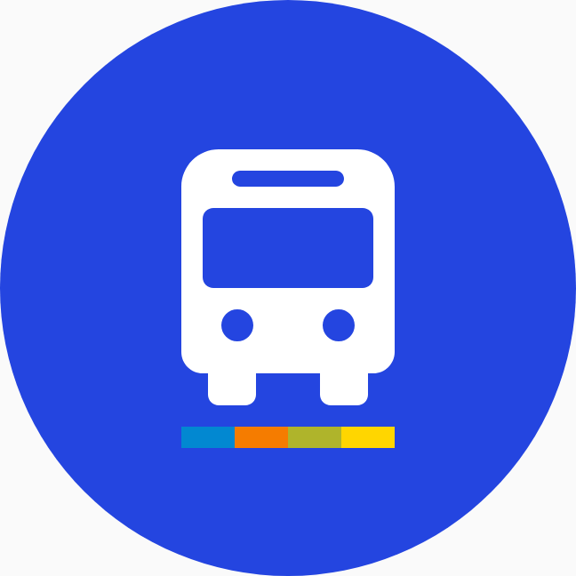
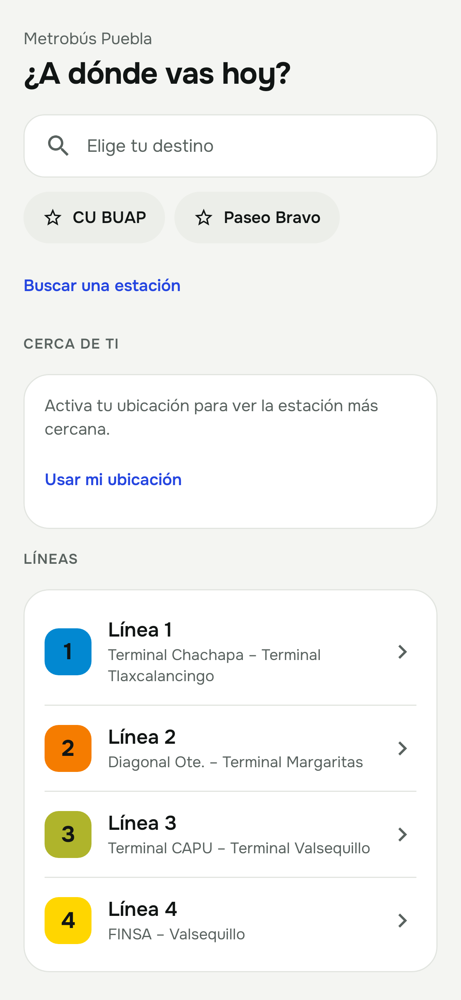
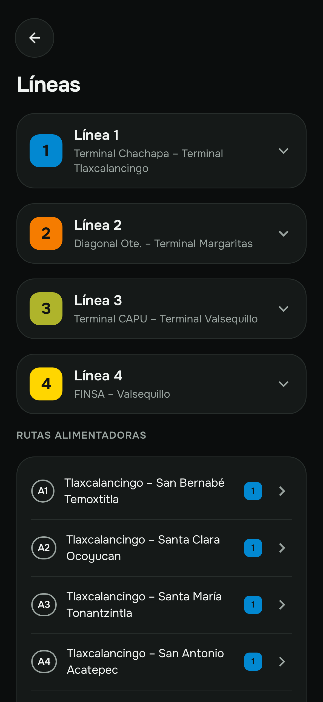
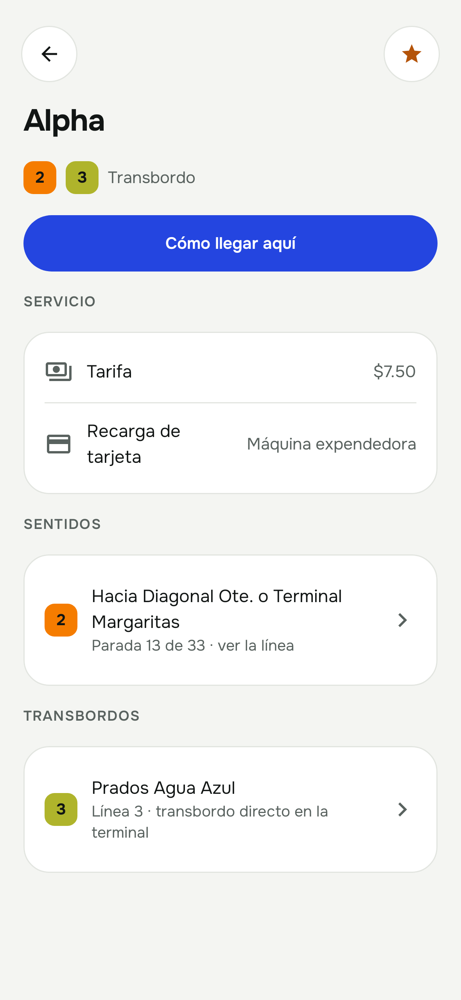
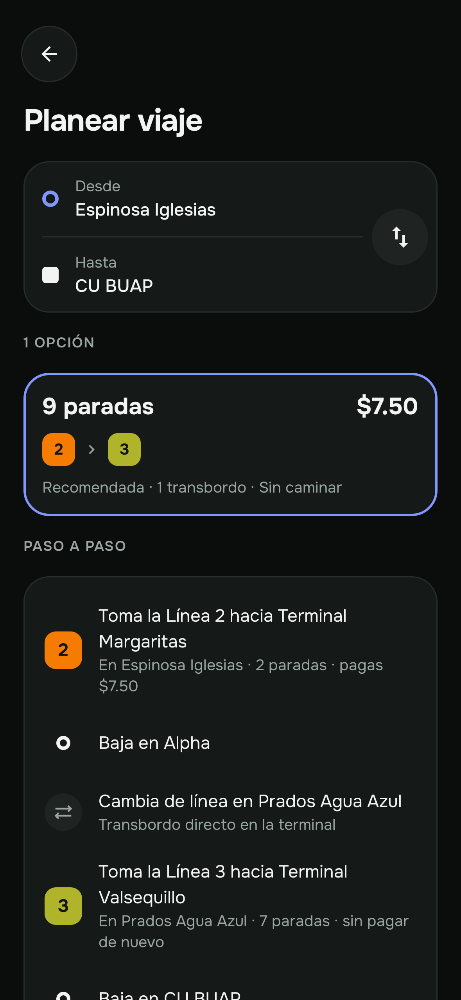
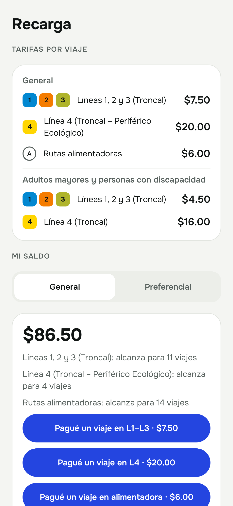
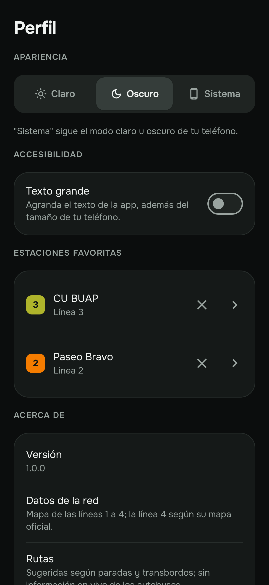

  

<h1 align="center">Metrobús Puebla</h1>

  App para Android de la red RUTA de Puebla: líneas, estaciones, mapa, rutas alimentadoras y planeador de viajes. 
  Funciona en modo claro y oscuro.

  <a href="../../releases/latest"><b>⬇ Descargar la última versión</b></a>

---

## Capturas

  
  
  

  
  
  

## Qué incluye

- **Las 4 líneas troncales** con sus estaciones en orden, transbordos y, en la Línea 4, cada sentido por separado.
- **Mapa** con las líneas y sus paradas, filtro por línea, tu ubicación y estilo de día o de noche.
- **Rutas alimentadoras** de las líneas 1, 2 y 3: se activan desde el botón de capas del mapa y se pueden ver una a la vez.
- **Planear viaje**: desde tu ubicación o una estación, con transbordos, paradas y costo.
- **Estación más cercana** a ti y **estaciones favoritas**.
- **Tarifas** general y preferencial, y un registro manual de tu saldo.
- **Modo claro y oscuro**, y opción de texto grande.

## Instalación

1. En la página de [Releases](../../releases/latest), descarga el APK:
   - `MetrobusPuebla-…-arm64.apk` — casi todos los teléfonos actuales.
   - `MetrobusPuebla-…-armv7.apk` — solo si el anterior no se instala (teléfonos de 32 bits).
2. Ábrelo en tu teléfono. Android te pedirá permitir **instalar apps desconocidas** desde el navegador o el administrador de archivos.
3. Listo. Para el mapa se necesita conexión a internet.

Requiere Android 8.0 o superior.

## Apoya el proyecto

Metrobús Puebla es gratis y sin anuncios. Si te es útil, puedes apoyar su desarrollo con una donación:

  <a href="https://link.mercadopago.com.mx/rutapuebla"><b>💙 Donar con Mercado Pago</b></a>

También está en la app, en **Perfil → Apoya el proyecto**.

## Privacidad

- **Sin cuentas, sin anuncios y sin rastreo propio.** La app no tiene servidor: no envía tus datos al autor.
- **Ubicación:** solo se usa en tu teléfono para mostrarte en el mapa y buscar la estación más cercana. Puedes negar el permiso y la app sigue funcionando.
- **Tus datos** (favoritas, saldo anotado, tema) se guardan únicamente en tu teléfono.
- **Mapa:** lo provee Mapbox, que carga las imágenes del mapa por internet y, por defecto, recopila estadísticas anónimas de uso. Puedes desactivarlo desde el botón **ⓘ** del mapa. Consulta la [política de privacidad de Mapbox](https://www.mapbox.com/legal/privacy).
- **Donaciones:** el botón abre Mercado Pago en tu navegador; la app no procesa pagos ni ve tus datos bancarios.

## Avisos

- **App no oficial.** No está afiliada a RUTA, al Sistema de Transporte Público de Puebla ni al Gobierno del Estado de Puebla.
- **Sin información en vivo.** La app no muestra la ubicación de los autobuses ni tiempos de llegada.
- **No lee tu tarjeta.** El saldo que muestra es el que tú anotas.
- Los datos de las líneas y rutas pueden contener errores; verifica en las estaciones.

## Créditos

- Mapa: © Mapbox © OpenStreetMap.
- Tipografía: Onest, © The Onest Project Authors, SIL Open Font License 1.1.

© 2026 Xavier Hernández. Todos los derechos reservados.
